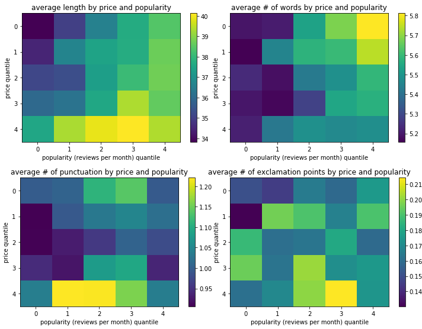
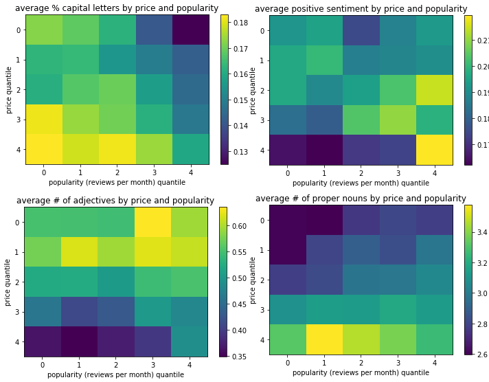
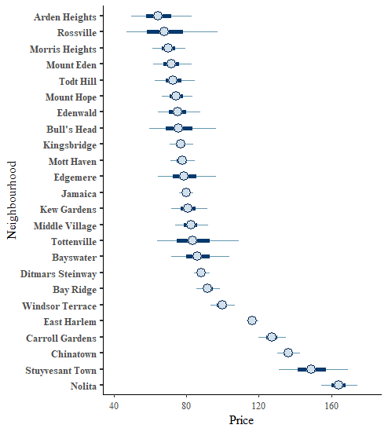
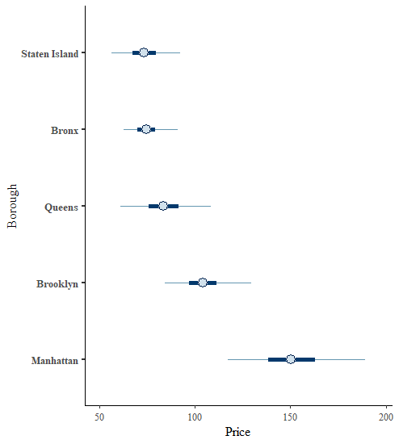
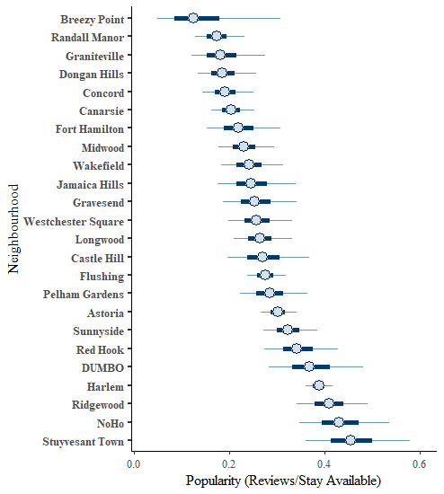
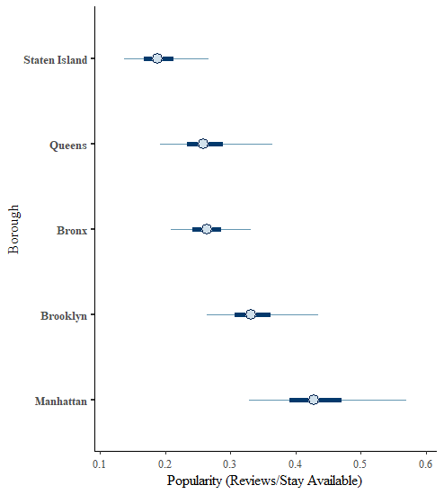

```{r,echo=FALSE,message=FALSE,warning=FALSE,}
library(tidyverse)
library(sf)
library(rnaturalearth)
library(rnaturalearthdata)
library(rgeos)
library(gridExtra)
library(ggridges)
library(broom)
library(sp)
library(kableExtra)
library(ggmap)
library(rgdal)
r <- rgdal::readOGR("community.geojson",verbose = F)
nyc_neighborhoods_df <- tidy(r)

data <- read_csv("AB_NYC_2019.csv")
data <- data %>% filter(number_of_reviews > 0, availability_365 > 0,price>0)
data <- data %>% mutate(reviews_per_stay = (reviews_per_month * minimum_nights )/availability_365)
```

# Introduction/EDA

 - New York City *Airbnb* data from 2019.
    - Variables include listing locations (neighbourhoods and NYC boroughs), price, and reviews per month.
    - Goal: Discover which variables contribute to price and popularity.
    - Presentation order: EDA/Text Analysis/Model.

 


# Distribution of Price
```{r,echo=FALSE,fig.align='left',fig.height=3,fig.width=4,warning=FALSE,message=FALSE,fig.cap="Log of Price"}
data %>% filter(price < 600) %>%
  ggplot(aes(x=log(price),y=neighbourhood_group)) + geom_density_ridges() + ylab(" ") + xlab("")
```


# Distribution of Price
```{r,echo=FALSE}
sites <- data %>% filter(price< 1000) %>% select(latitude,longitude,price)
names <- c("Brooklyn", "Manhattan", "Queens", "Staten Island","Bronx")
lat <- c(40.673611,40.779746,40.7282,40.5795,40.8448)
lon <- c(-73.944313,-73.970658,-73.7949,-74.1502,-73.8648)
points <- tibble(names,lat,lon)
longitude.min <- min(sites$longitude); longitude.max <- max(sites$longitude)
latitude.min <- min(sites$latitude); latitude.max <-  max(sites$latitude)
```


```{r,echo=FALSE,fig.align='center',fig.height=3,fig.width=4,warning=FALSE,fig.cap="Distribution of Price"}
ggplot() + 
  geom_polygon(data=nyc_neighborhoods_df, aes(x=long, y=lat, group=group)) +
  geom_point(data = sites, aes(x = longitude, y = latitude,col=price), size = 0.05,   shape = 20,show.legend = FALSE) +
  geom_text(aes(x=lon,y=lat,label=names),data=points)+ xlim(c(longitude.min,longitude.max))  +
  ylim(c(latitude.min, latitude.max)) + 
  guides(alpha= FALSE) +
  scale_color_continuous(name="Room Type") +
  theme(axis.title.x=element_blank(),
        axis.text.x=element_blank(),
        axis.ticks.x=element_blank(),
        axis.title.y=element_blank(),
        axis.text.y=element_blank(),
        axis.ticks.y=element_blank(),
        legend.text = element_text(size=4),
        legend.title = element_text(size=4),
        legend.background = element_rect(size=4)
  )  
```


# Distribution of Room Type

```{r,echo=FALSE,fig.align='center',fig.height=3,fig.width=4,fig.cap="Distribution of Room Type Weighted by Price"}
sites <- data %>% filter(price < 600)  %>% select(latitude,longitude,room_type,price)
ggplot() + 
  geom_polygon(data=nyc_neighborhoods_df, aes(x=long, y=lat, group=group)) +
  geom_point(data = sites, aes(x = longitude, y = latitude,col=room_type,alpha=price), size = 0.05,   shape = 20,show.legend = FALSE) +
  geom_text(aes(x=lon,y=lat,label=names),data=points)+ xlim(c(longitude.min,longitude.max))  +
  ylim(c(latitude.min, latitude.max)) + 
  guides(alpha= FALSE) +
  theme(axis.title.x=element_blank(),
        axis.text.x=element_blank(),
        axis.ticks.x=element_blank(),
        axis.title.y=element_blank(),
        axis.text.y=element_blank(),
        axis.ticks.y=element_blank(),
        legend.text = element_text(size=4),
        legend.title = element_text(size=4),
        legend.background = element_rect(size=4)
  ) 
                      
```


# Distribution of Reviews per Stay 

```{r,echo=FALSE,fig.align='left',fig.height=3,fig.width=4,warning=FALSE,message=FALSE,fig.cap="Log of Reviews Available Per Stay"}
data %>% filter(reviews_per_stay < 0.5) %>%
  ggplot(aes(x=log(reviews_per_stay),y=neighbourhood_group)) + geom_density_ridges() + ylab(" ") + xlab("")
```


# Distribution of Reviews per Stay

```{r,echo=FALSE,fig.align='center',fig.height=3,fig.width=4,warning=FALSE,fig.cap="Distribution of Price Weighted by Reviews per Available Stay"}
sites <- data  %>% filter(reviews_per_stay > 0, price < 600) %>% select(latitude,longitude,reviews_per_stay,price)
ggplot() + 
  geom_polygon(data=nyc_neighborhoods_df, aes(x=long, y=lat, group=group)) +
  geom_point(data = sites, aes(x = longitude, y = latitude,col=price,alpha=reviews_per_stay), size = 0.05,   shape = 20,show.legend = FALSE) +
  geom_text(aes(x=lon,y=lat,label=names),data=points)+ xlim(c(longitude.min,longitude.max))  +
  ylim(c(latitude.min, latitude.max)) + 
  guides(alpha= FALSE) +
  theme(axis.title.x=element_blank(),
        axis.text.x=element_blank(),
        axis.ticks.x=element_blank(),
        axis.title.y=element_blank(),
        axis.text.y=element_blank(),
        axis.ticks.y=element_blank(),
        legend.text = element_text(size=4),
        legend.title = element_text(size=4),
        legend.background = element_rect(size=4)
  )  
```

# Text Analysis

- Analyzed various text features for listing names
- Length (in characters), # of words, % capitalization
- Number of punctuation, number of exclamations
- Sentiment analysis using Python's NLTK to determine positive sentiment
- Number of adjectives, number of proper nouns

# Text Analysis

```{r, echo=FALSE, out.width = '85%',fig.pos="c"}

```

# Text Analysis

```{r, echo=FALSE, out.width = '85%',fig.pos="c"}

```


# Expensive & Popular Words

- Expensive: fee, beekman, wyndham, service, tower, spectacular, triplex
- Popular: convenience, long, easy, more, outdoor, jewel


# Analysis

- Drop Zero Review/Zero Days Available
- Cap Price at 600/Cap Minimum Stay at 30
- Defined a popularity metric as: $\text{reviews per stay = }\frac{(\text{reviews per month})}{(\text{availability 365})/(\text{minimum nights})}$
  - $(\text{availability 365})/(\text{minimum nights}) \approx \text{number of possible bookings}$
  - Serves as a "corrected" version of reviews per month.

# CAR Model

Specify CAR structure for $\phi$:
$$
  \phi_i|\phi_{-i},\tau_i^2\sim N\bigg(\rho\sum b_{ij}\phi_j,\tau_i^2\bigg)
$$
- Set $b_{ij} = w_{ij} / w_{i+}$ ($w_{i+}$ is $i's$ neighbor count)

- Set $\tau_i^2 = \frac{\sigma^2}{w_{i+}}$

Then we have joint distribution:

$$
\phi|W,\sigma^2\sim N\big(0,\sigma^2(D-\rho W)^{-1}\big)
$$
- W is adjacency matrix of neighborhoods

- D is diagonal with $d_{ii}$ the count of $i's$ neighbors

- $\rho\in(0,1)$ calibrates strength of relationship/controls pairwise covariance

(See (Gelfand, Vounatsou 2003.) for further details)

# Price Model Output

```{r, echo=FALSE, out.width = '60%',fig.pos="c"}
 
```

# Price Model Output

```{r, echo=FALSE, out.width = '60%',fig.pos="c"}

```

# Price Model Output

```{r,echo=FALSE}
pricefixedeffect <- readRDS("PriceFixedEffect.rds")
kable(pricefixedeffect,caption="Percentage Change in Price per Unit of Variable") %>% kable_styling(latex_options="scale_down")
```

# Popularity Model Output

```{r, echo=FALSE, out.width = '60%',fig.pos="c"}

```


# Popularity Model Output

```{r,echo=FALSE, out.width = '60%',fig.pos="c"}

```

# Popularity Model Output

```{r,echo=FALSE,out.width='60%'}

popfixedeffect <- readRDS("PopularityFixedEffect.rds")
kable(popfixedeffect,caption="Percentage Change in Popularity per Unit of Variable") %>% kable_styling(latex_options="scale_down")
```

# Listing Type Hetergeneity Across Neighborhoods/Boroughs

```{r, echo = F}

use.saved = T

if (use.saved == T) {
  tab = readRDS("Hetergeneity.rds")
} else {
  dat2 = read_csv("AB_NYC_2019.csv")
  pval = round(chisq.test(table(dat2$neighbourhood, dat2$room_type))$p.value,4)
  pval.fisher = round(fisher.test(table(dat2$neighbourhood_group, dat2$room_type), simulate.p.value = T, B = 1000000)$p.value,4)
  het.tab = data.frame(Test = c("Overall.Nbhd"), ChiSq.P.Val = pval, Fisher.P.Val = pval.fisher)

  boroughs = unique(dat2$neighbourhood_group)
  
  for (bor in boroughs) {
    temp.dat = dat2 %>% filter(neighbourhood_group == bor)
    pval = round(chisq.test(table(temp.dat$neighbourhood, temp.dat$room_type))$p.value, 3)
    pval.fisher = round(fisher.test(table(temp.dat$neighbourhood, temp.dat$room_type), simulate.p.value = T, B = 1000000)$p.value,4)
    het.tab = rbind(het.tab,data.frame(Test = paste0(bor,".Nbhd"), ChiSq.P.Val = pval, Fisher.P.Val = pval.fisher))
  }
  
  pval = round(chisq.test(table(dat2$neighbourhood_group, dat2$room_type))$p.value,4)
  pval.fisher = round(fisher.test(table(dat2$neighbourhood_group, dat2$room_type), simulate.p.value = T, B = 1000000)$p.value, 4)
  het.tab = rbind(het.tab,data.frame(Test = "Borough", ChiSq.P.Val = pval, Fisher.P.Val = pval.fisher))
  tab = het.tab
}

knitr::kable(tab)


```

- Low cell count renders Chi-Square inexact
- Fisher Exact test as alternative
- Both indicate strong heterogeneity, as suggested by EDA
- Staten Island a bit less-so


# Conclusion
- Based on our results, an example of an expensive listing is:
    - **entire apartment is available for rent conveniently located in the Tribeca neighborhood of Manhattan island...please contact for details...pricing subject to negotiation"**
- Replace location with "East Harlem" to maximize popularity.
- Replace location with "Financial District" to balance both.
