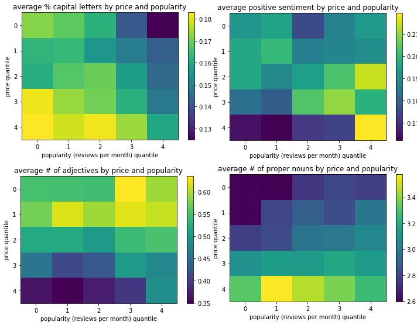

```{r setup, include=FALSE}
knitr::opts_chunk$set(echo = TRUE)
```

## Introduction

We analyzed data from Airbnb, a platform that allows hosts to rent out their homes to short- and long-term guests. 48,895 listings from 2019 in New York City, NY (NYC) were analyzed, with features including (1) information about the host, including host ID, name, and number of listings the host owns; (2) listing name and ID; (3) information about the location of the listing, including the borough and neighborhood in NYC as well as longitude and latitude; (4) room type; (5) minimum nights required to stay; (6) price; (7) information regarding the reviews left by guests, including number of reviews, date of last review, and average reviews per month; and (8) availability of the listing. Through this analysis, we seek to understand (1) influential factors on the price and popularity of listings, (2) if there exists heterogeneity among buroughs and/or neighborhoods (and, if so, which are the most expensive and popular), (3) whether room type availability varies across neighborhoods, and (4) how to name and where to locate a popular and expensive listing in NYC.

## Data Cleaning

See the appendix for variable descriptions. The Airbnb dataset contains a total 48,895 observations. We were primarily interested in listings comparable to a standard hotel or condominium rental. Therefore, we removed all observations in which _minimum_nights_ was greater than thirty and _price_ greater than six hundred dollars. The _reviews_per_month_ variable contains 10,052 _NA_ values, which presumably are due to an observation of zero _number_of_reviews_. In such cases, we are not guaranteed that the listing has been booked previously. Therefore, we decided to remove these observations. In addition, there were 17,533 observations which had zero days available. We are not told why these observations had zero days available, and it is possible that these listings are no longer on the market. In such a cases, the corresponding price could be unreliable. Therefore, we removed these observations as well. After filtering the data, we were left with 23,308 observations. 

## Transformations

We took a logarithmic transformation of _price_ to make its distribution approximately Gaussian. See Figure 1 in the appendix for kernel density estimates of the logarithmic price for each borough. Aside from Staten Island, the density estimates for each borough appear fairly symmetric. We defined our own _reviews_per_available_stay_ popularity metric, which is a simple transformation of _reviews_per_month_:
$$
\text{reviews_per_available_stay} = \frac{\text{reviews_per_month}}{\text{availability_365} / \text{minimum_nights}} * 12
$$
See Figure 2 in the appendix for kernel density estimates of the log of _reviews_per_available_stay_ for each borough. The density estimates appear approximately Gaussian. However, we note that there were a few very large observations in each distribution.  

## Geographic Distribution of Price, Popularity, and Listing Type

  In addition to price and popularity, we were also interested in the distribution of listing types across neighborhoods and boroughs. A geographic distribution of listing types is given in Figure 4 in the appendix. As expected, we see that most apartment/full home listings are located in the lower Manhattan areas and downtown areas of Brooklyn. Most private room listings are located in Queens, the Bronx, and the Eastern area of Brooklyn, which tended to have "less urban" neighborhoods. Notice that in Figure 3, higher listing prices are primarily located in lower Manhattan and the downtown areas of Brooklyn as well. With this in mind, there appears to be a fairly strong association between listing type and location. 
  In Figure 5, we give the same price distribution as that in Figure 3, except now the points are weighted by our _reviews_per_available_stay_ variable. By weighting the observations, we can see clusterings of high _reviews_per_available_stay_ values, possibly corresponding to different neighborhoods. Also, notice that observations with high _reviews_per_available_stay_ values tended to not have the highest price possible, but rather remained around the three hundred dollar or less range.  


## Text Analysis
We analyzed various text features for listing names, including: (1) length, in characters and words, (2) percentage of listings that are capitalized, (3) amount of punctuation and exclamations, (4) positive sentiment using Python's NLTK package, and (5) number of adjectives and proper nouns. 

In order to better understand the relationship between each of these features on price and popularity, we sorted price and popularity into five quantiles and then determined the mean value for each text feature in each of the 25 "buckets".

We noticed several interesting patterns. In general, listings with (1) a higher average length (in characters) and (2) more words were more expensive and popular. On the other hand, listings with more capital letters (by percentage) were less expensive and popular. Furthermore, listings with (1) more positive sentiment, and (2) more adjectives were less expensive but more popular. Listings with (1) more punctuation and (2) more proper nouns were more expensive, but not clearly any more or less popular. Finally, there was no clear impact on the amount of exclamations. See appendix for more detailed plots.

We also conducted an analysis to understand the most expensive and popular words, defined by the average price and popularity of the listings that each word appeared in. The most expensive words included "fee", "beekman", "wyndham", "service", "tower", "spectacular", and "triplex". The most popular words included "convenience", "long", "easy", "more", "outdoor", and "jewel".

## Model

We chose to attempt to model both the naturally hierarchical structure of neighborhoods nested within boroughs, as well as the spatial dependency among adjacent neighborhoods. For the hierarchical part, we opted for a hierarchical linear model with random intercept driven by random effects for neighborhoods nested within their respective boroughs. For the spatial component, we opted to model a conditionally autoregressive (CAR) structure at the borough level. A general specification for a CAR structure on a vector $\phi$ is:
$$
  \phi_i|\phi_{-i},\tau_i^2\sim N\bigg(\rho\sum b_{ij}\phi_j,\tau_i^2\bigg)
$$
where we take $\rho\in(0,1)$. We define an adjacency matrix $W$ over neighborhoods, with $D$ a diagonal matrix whose entries are the row sums of $W$, i.e. the degree of each neighborhood. We discuss our method for generating $W$ below. If we set $b_{ij} = w_{ij} / d_{ii}$ and set $\tau_i^2 = \frac{\sigma^2}{d_{ii}}$, then we have joint distribution:

$$
\phi|W,\sigma^2\sim N\big(0,\sigma^2(D-\rho W)^{-1}\big)
$$

(See (Gelfand, Vounatsou 2003.) for further details). For generating the adjacency matrix that helps determine our spatial structure, we chose to define a distance metric between neighborhoods equal to the mean of the pairwise distance between listing coordinates for each pair of listings in the two neighborhoods. We then set a threshold for adjacency at $.05$, which was chosen to provide that each neighborhood have at least one neighbor. We considered the alternative of simply taking the means of coordinates for each neighborhood, and then taking distances between those. In practice this gave almost the same results, though we like certain features of former method compared to the latter, such as mean coordinates not accounting for degree of spread, so we chose the latter despite higher computational costs. We also considered some more advanced metrics such as the Earth Mover's Distance, but this was deemed computationally prohibitive. We also imposed the constraint that adjacent neighborhoods be in the same Borough, which emphasizes the nesting of neighborhoods within boroughs, and because it is beneficial for computational efficiency. Because there is comparatively minor adjacency between neighborhoods of differing boroughs, this does not seem an overly risky assumption.

We placed $Gamma(.1,.1)$ priors on our precison parameters, and placed weakly informative normal priors on our coefficient/mean parameters. Our final models can be represented as:

$$
  \log(price)\sim X\beta + \alpha_{Borough} + \phi_{neighborhood} +\epsilon
$$

And

$$
  \log(popularity)\sim X'\beta' + \alpha'_{Borough} + \phi'_{neighborhood} +\epsilon
$$
Where the $X's$ are the matrices of fixed effect predictors, $\beta's$ their coefficients, the $\alpha's$ the Borough random intercepts, and the $\phi's$ the auto-correlated neighborhood random effects. $\epsilon$ is an idiosyncratic noise term. We coded this model in Stan, which we ran for 4 chains of 10000 iterations each. The mixing appears to be acceptable with acceptable effective sample sizes for parameters of interest. In addition, traceplots of the parameters indicated acceptable mixing. Despite efforts at increasing efficiency, especially regarding efficiently computing the log likelihood of the CAR component $\phi$, as it involves working with rather large matrices, we still struggled with the long run times of our models. Further study is needed to ascertain whether further efficiencies can be gained by taking advantage of structural aspects of our model assumptions. We detected heterogeneity in both popularity and pricing across both boroughs and neighborhoods, as well as strong effects of listing type on both popularity and price, where whole home/apartment listings tended to be much more popular and pricey. We further determined that certain listing text features were significant for popularity and price. One interesting example is that the percentage of capital letter (excluding proper nouns) appears to be negatively correlated with the popularity of a listing. One conjecture is that this has to do with the dissuading effect of the relatively common listings that appear in all capitals, though more study is needed to lend this conjecture creedence. Another is that positive sentiment appears to be slightly negatively associated with pricing. As this is quite counterintuitive, more examination is needed to ascertain the robustness of these results.

In order to investigate heterogeneity of room type across neighborhoods, we initially performed a Chi-Squared test for indendence. We recognized this test as theoretically suspect given the low bucket counts for many of the neighborhood-room type cells, and we thus opted to perform Fisher's Exact Test as well, with simulated p-values due to the computational intractibility introduced by high cell counts and by the large number of neighborhood cells. Both of these tests suggested strong heterogeneity of room types across neighborhoods, something that our exploratory data analysis similarly confirmed. We also performed these tests restricted to each of the boroughs, and found strongly in favor of heterogeneity their as well. Out of interest, we also performed the tests for the borough-room type contingency, and we similarly found heterogeneity at that level. Again, these results make more formal the clear indication of our exploratory data analysis work for the same conclusions.

## Conclusion

  To conclude, we set out to determine what geographic, listing, and textual features serve as indicators of relative pricing and popularity in a selection of AirBnB listings in New York, New York. In order to focus our analysis, we performed some data culling, and to inform our analysis, we explored a variety of data visualizations, including geographic ones to explore spatial distribution of parameters of interest. We also performed a variety of text analyses to suggest certain patters, such as sentiment, capital letters, word length, etc, which might inform us regarding listing price and popularity. We opted for a hierchical random intercept model with neighborhoods effects nested within borough effects, with a variety of fixed effects, and with a CAR structure imposed at the neighborhood level. 

  Our findings included strong benefits to whole room/apartment listings for both price and popularity (as we defined it), strong heterogeneity in pricing and popularity across neighborhoods. Tribeca was the most expensive neighborhood, East Harlem the most popular, with the Financial District in our judgement maximizing the combination of price and popularity. East Harlem is a bit surprising to us, and further investigation is warranted into whether our metric is the source of some odd effects. We identified a number of textual features of importance in price and popularity, including the percentage of capital letters and average word length, and a surprising negative association between text sentiment and price. We also found strong evidence of heterogeneity in listing type across both neighborhoods and boroughs. Finally, we present our formulations of what are good apartment advertisements under our results: 
\begin{center}
  "entire apartment is available for rent conveniently located in the Tribeca neighborhood of Manhattan island. . . please contact for details. . . pricing subject to negotiation."
\end{center}

\newpage 

## Appendix

|Variable Name| Description|
|-------------|------------|
|id|listing ID|
|name|name of the listing|
|host_id|host ID|
|host_name|name of the host|
|neighbourhood_group|name of the borough (Manhattan, Brooklyn, etc.)|
|neighbourhood|name of the area/neighborhood|
|latitude|latitude coordinates|
|longitude|longitude coordinates|
|room_type|listing space type|
|price|price in dollars|
|minimum_nights|amount of nights minimum (that a guest can stay there)|
|number_of_reviews|number of reviews|
|last_review|latest review|
|reviews_per_month|number of reviews per month|
|calculated_host_listings_count|amount of listing per host|
|availability_365|number of days when listing is available for booking|


```{r,echo=FALSE,message=FALSE,warning=FALSE}
library(tidyverse)
library(sf)
library(rnaturalearth)
library(rnaturalearthdata)
library(rgeos)
library(gridExtra)
library(ggridges)
library(broom)
library(sp)
library(kableExtra)
library(ggmap)
library(rgdal)
r <- rgdal::readOGR("community.geojson",verbose = F)
nyc_neighborhoods_df <- tidy(r)

data <- read_csv("AB_NYC_2019.csv")
data <- data %>% filter(number_of_reviews > 0, availability_365 > 0,price>0 & price < 600, minimum_nights < 30)
data <- data %>% mutate(reviews_per_stay = (reviews_per_month * minimum_nights )/availability_365)
```


```{r logprice,echo=FALSE,warning=FALSE,message=FALSE,fig.height=3.5,fig.width=7.5,fig.cap="\\label{fig:logprice}Logarithm of Price Density Estimates by Borough"}
data %>% filter(price < 600) %>%
  ggplot(aes(x=log(price),y=neighbourhood_group)) + geom_density_ridges() + ylab(" ") + xlab("")
```

```{r,echo=FALSE,fig.height=3.5,fig.width=7.5,warning=FALSE,message=FALSE,fig.cap="Log of Reviews Available Per Stay"}
data %>% filter(reviews_per_stay < 0.5) %>%
  ggplot(aes(x=log(reviews_per_stay),y=neighbourhood_group)) + geom_density_ridges() + ylab(" ") + xlab("")
```

```{r,echo=FALSE}
sites <- data %>% filter(price< 600) %>% select(latitude,longitude,price)
names <- c("Brooklyn", "Manhattan", "Queens", "Staten Island","Bronx")
lat <- c(40.673611,40.779746,40.7282,40.5795,40.8448)
lon <- c(-73.944313,-73.970658,-73.7949,-74.1502,-73.8648)
points <- tibble(names,lat,lon)
longitude.min <- min(sites$longitude); longitude.max <- max(sites$longitude)
latitude.min <- min(sites$latitude); latitude.max <-  max(sites$latitude)
```


```{r,echo=FALSE,fig.height=3.5,fig.width=7.5,warning=FALSE,fig.cap="Geographic Distribution of Price"}
ggplot() + 
  geom_polygon(data=nyc_neighborhoods_df, aes(x=long, y=lat, group=group)) +
  geom_point(data = sites, aes(x = longitude, y = latitude,col=price), size = 0.05,   shape = 20,show.legend = TRUE) +
  geom_text(aes(x=lon,y=lat,label=names),data=points)+ xlim(c(longitude.min,longitude.max))  +
  ylim(c(latitude.min, latitude.max)) + 
  xlab("Longitude") + ylab("Latitude") + scale_color_gradient(low = "blue", high = "red")
```

```{r,echo=FALSE,fig.height=3.5,fig.width=7.5,fig.cap="Distribution of Room Type Weighted by Price"}
sites <- data %>% filter(price < 600)  %>% select(latitude,longitude,room_type,price)
ggplot() + 
  geom_polygon(data=nyc_neighborhoods_df, aes(x=long, y=lat, group=group)) +
  geom_point(data = sites, aes(x = longitude, y = latitude,col=room_type,alpha=price), size = 0.05,   shape = 20) +
  geom_text(aes(x=lon,y=lat,label=names),data=points)+ xlim(c(longitude.min,longitude.max))  +
  ylim(c(latitude.min, latitude.max)) + 
  guides(alpha= FALSE) +
  xlab("Longitude") + ylab("Latitude") +
  scale_color_discrete(name="Room Type")
```

```{r,echo=FALSE,fig.height=3.5,fig.width=7.5,fig.cap="Distribution of Price Weighted by Reviews per Available Stay"}
sites <- data  %>% filter(reviews_per_stay > 0, price < 600) %>% select(latitude,longitude,reviews_per_stay,price)
ggplot() + 
  geom_polygon(data=nyc_neighborhoods_df, aes(x=long, y=lat, group=group)) +
  geom_point(data = sites, aes(x = longitude, y = latitude,col=price,alpha=reviews_per_stay), size = 0.0005,   shape = 20) +
  geom_text(aes(x=lon,y=lat,label=names),data=points)+ xlim(c(longitude.min,longitude.max))  +
  ylim(c(latitude.min, latitude.max)) +
  xlab("Longitude") + ylab("Latitude") + scale_color_gradient(low = "blue", high = "red")
```


```{r,echo=FALSE,fig.height=2.75,fig.width=7.5,fig.cap="Price Model Output Neighborhoods"}
knitr::include_graphics("NeighborhoodPrice.png")
```


```{r,echo=FALSE,fig.height=2.75,fig.width=7.5,fig.cap="Price Model Output Boroughs"}
knitr::include_graphics("PriceBorough.png")
```


```{r,echo=FALSE,fig.height=2.75,fig.width=7.5,fig.cap="Price Model Fixed Effect Sizes"}
pricefixedeffect <- readRDS("PriceFixedEffect.rds")
kable(pricefixedeffect,caption="Percentage Change in Price per Unit of Variable") %>% kable_styling(latex_options="scale_down")
```


```{r, echo=FALSE,fig.height=2.75,fig.width=7.5,fig.cap="Popularity Model Output Neighborhoods"}
knitr::include_graphics("PopularityNeighborhood.png")
```


```{r,echo=FALSE, out.width = '80%',fig.cap="Text Analysis Results"}
knitr::include_graphics("plots/1.png")
```

```{r, echo=FALSE, out.width = '80%',fig.cap="Text Analysis Results"}

```


